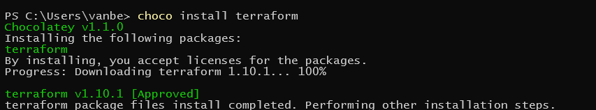
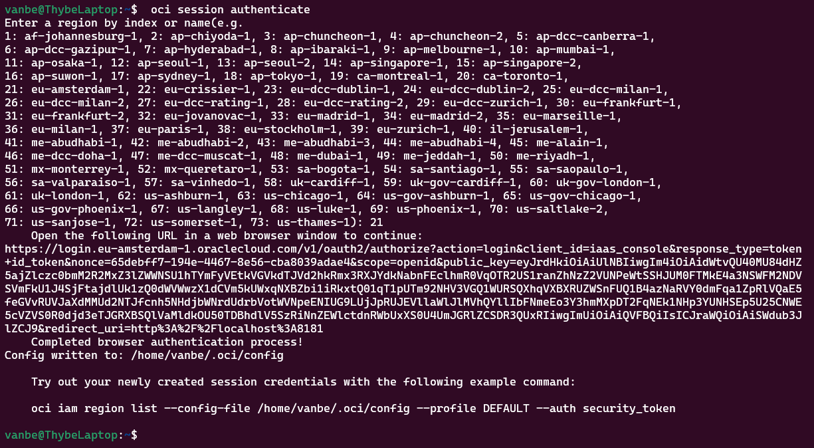
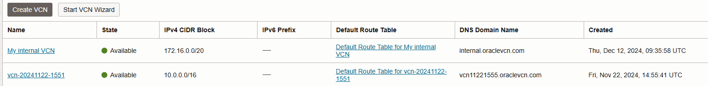

[](https://classroom.github.com/a/x34QSMR0)

# Cloud Infrastructure - Reminder App

In deze repository beschrijven we het proces van een simpele Node.js app naar een applicatie die als cluster kan worden gedeployed. Dit evolueert doorheen verschillende software oplossingen.

## Reminder App

De eigenlijke app is gemaakt met HTML, CSS en Javascript. De website maakt gebruik van Bootstrap om een simpele weergave te geven van herinneringen. Die herinneringen kan je met een CRUD-systeem creëren, aanpassen en verwijderen. Die CRUD aanvragen worden gestuurd naar een express.js backend. In deze backend worden de requests behandeld en verwerkt in een MongoDB database.
De webapp bestaat dus uit volgende delen:

-   Frontend (HTML, CSS, JS)
-   Backend (Node.js - Express)
-   Database (MongoDB - Mongoose)

## Docker

Om onze webapp te Dockerizen, moeten we voor de gebruikte services een Dockerfile moeten maken. Services die in Docker Hub al een image hebben kunnen we pullen. Dit wordt samengebracht in een Docker Compose file. Concreet beslis ik voor de Node app een Dockerfile te maken. Voor MongoDB en Nginx (de webserver die we zullen gebruiken om de frontend op te hosten) kunnen we een bestaande image gebruiken.

Voorlopig zijn er in onze docker-compose drie services. Twee daarvan worden rechtstreeks gepulled van Docker Hub. De laatste, onze app zelf, wordt zelf gemaakt via een Dockerfile. Deze zullen we builden in een image.
Volgende commando's worden hiervoor gebruikt. (working directory is `/docker/reminder-app/`)

```console
docker buildx create --use
docker buildx build --platform linux/amd64,linux/arm64 -t reminder-app .

#Pushen naar Docker Hub
todo
```

## Terraform

Om Terraform te installeren gebruiken we Chocolatey for Windows. Dit is een package manager die ons toelaat makkelijk applicaties te installeren zonder zelf bv. PATHs aan te moeten passen.



### Oracle OCI Integratie

Om via Terraform te deployen naar OCI (Oracle Cloud Infrastructure) zullen we de OCI CLI moeten installeren. Deze CLI zal automatisch een token maken die later zal worden gebruikt in Terraform. Volgende commando's tonen hoe dit wordt geïnstalleerd.

```console
Set-ExecutionPolicy RemoteSigned
Invoke-WebRequest https://raw.githubusercontent.com/oracle/oci-cli/master/scripts/install/install.ps1 -OutFile install.ps1
iex ((New-Object System.Net.WebClient).DownloadString('https://raw.githubusercontent.com/oracle/oci-cli/master/scripts/install/install.ps1'))
```

Om dit alternatief in Linux te doen, is het maar één commando. Om dat ik redelijk wat problemen had met de Windows versie koos ik ervoor dit in Ubuntu te doen.

```console
bash -c "$(curl -L https://raw.githubusercontent.com/oracle/oci-cli/master/scripts/install/install.sh)"
```

Eenmaal de CLI is geïnstalleerd, kunnen we de sessie met OCI initializeren.


Door een tutorial van OCI/Terraform te volgen maken we een basisconfiguratie voor het deployen met OCI. De SecurityToken wordt gehaald uit de machine met de cli, en de compartment_id wordt gehaald uit een `secrets.auto.tfvars` file.

```console
terraform {
  required_providers {
    oci = {
      source = "oracle/oci"
    }
  }
}

provider "oci" {
  region              = "eu-amsterdam-1"
  auth                = "SecurityToken"
  config_file_profile = "profile"
}

resource "oci_core_vcn" "internal" {
  dns_label      = "internal"
  cidr_block     = "172.16.0.0/20"
  compartment_id = var.compartment_id
  display_name   = "My internal VCN"
}

variable "compartment_id" {
  type        = string
  sensitive   = true
}
```

Na ```terraform apply``` uit te voeren zien we dat in Oracle een VCN werd gemaakt.


## Minikube

```console
minikube start --driver=docker
```
