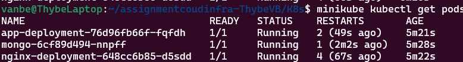
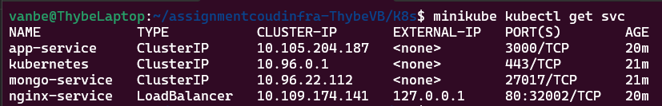
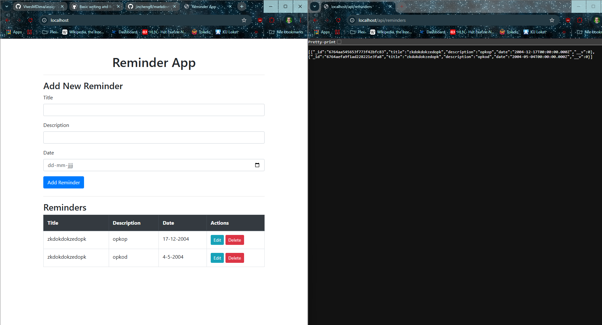
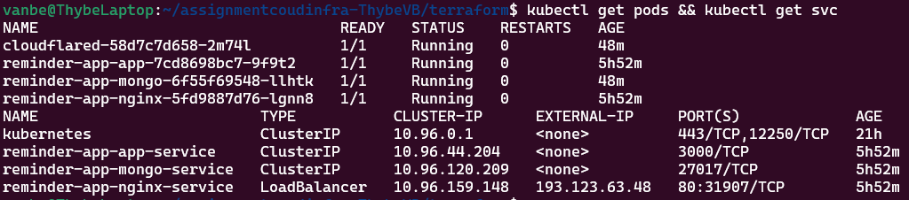
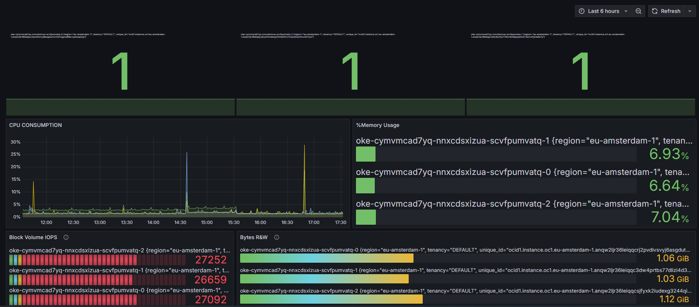
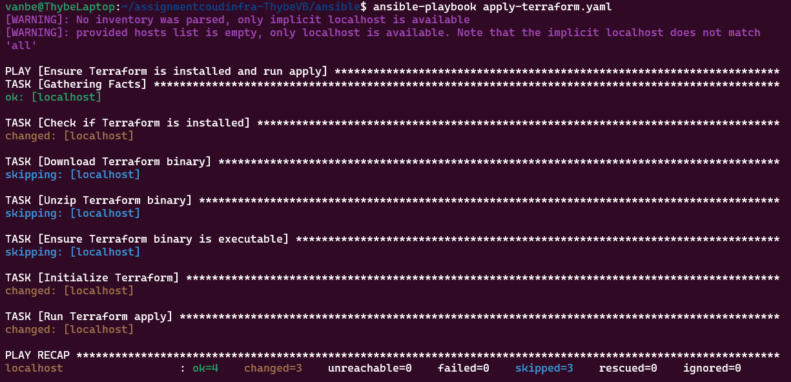

# Cloud Infrastructure - Reminder App

In deze repository beschrijven we het proces van een simpele Node.js app naar een applicatie die als cluster kan worden gedeployed. Dit evolueert doorheen verschillende software oplossingen. Standaard wordt een WSL2 Ubuntu 24.04 machine gebruikt om alle commando's uit te voeren. 

## Reminder App

De eigenlijke app is gemaakt met HTML, CSS en Javascript. De website maakt gebruik van Bootstrap om een simpele weergave te geven van herinneringen. Die herinneringen kan je met een CRUD-systeem creëren, aanpassen en verwijderen. Die CRUD-aanvragen worden gestuurd naar een Express.js backend. In deze backend worden de requests behandeld en verwerkt in een MongoDB database.

De webapp bestaat dus uit de volgende delen:

- **Frontend** (HTML, CSS, JS) -> uiteindelijk op Nginx
- **Backend** (Node.js - Express)
- **Database** (MongoDB - Mongoose)

## Docker

Om onze webapp te dockerizen, moeten we voor de gebruikte services een Dockerfile maken. Services die in Docker Hub al een image hebben, kunnen we pullen. Dit wordt samengebracht in een Docker Compose file. Concreet beslis ik voor de Node app een Dockerfile te maken. Voor MongoDB en Nginx (de webserver die we zullen gebruiken om de frontend op te hosten) kunnen we een bestaande image gebruiken.

Voorlopig zijn er in onze docker-compose drie services. Twee daarvan worden rechtstreeks gepulled van Docker Hub. De laatste, onze app zelf, wordt zelf gemaakt via een Dockerfile. Deze zullen we builden in een image.

Volgende commando's worden hiervoor gebruikt (working directory is `/docker/reminder-app/`):

```bash
# Pushen naar Docker Hub
docker build -t thybevb/reminder-app:latest .
docker images -> image id kopiëren
docker tag <image-id> thybevb/reminder-app:latest
docker push thybevb/reminder-app:latest
```

## Minikube / Kubernetes

Om Minikube te installeren (in mijn geval op WSL2 Ubuntu), moet ook Docker Engine draaien op de machine om als driver te werken bij Minikube. Daarna kunnen we Minikube starten:

```bash
minikube start --driver=docker
```

Met een werkende Minikube kunnen we beginnen met onze Kubernetes-configuraties. Omdat we in het deel over Docker onze image hebben gepushed op Docker Hub, kan ik in Kubernetes een deployment file maken hiervoor. Dit kan ook voor onze andere nodige services: MongoDB en Nginx. 

Dit is een overzicht van de [gemaakte bestanden](./K8s/):

- `app-deployment.yaml`
- `mongo-deployment.yaml`
  - `mongo-storage.yaml`
- `website-configmap.yaml`
- `nginx-deployment.yaml`
  - `nginxconfig-configmap.yaml`

Elk deployment bestand bevat een **Deployment** en een **Service** onderdeel. Dit kan ook opgesplitst worden met een services bestand, maar ik vond dit overzichtelijker om het in hetzelfde bestand te zetten. Merk ook op dat er config bestanden zijn. Deze zijn ondersteunende configbestanden voor de deployments. We kunnen al de scripts applyen via het `apply.sh` bestand:

```bash
#!/bin/bash

# Config maken voor de MongoDB deployment
# mongo-storage voor persistent data
minikube kubectl -- apply -f mongo-storage.yaml
minikube kubectl -- apply -f mongo-deployment.yaml

# Config maken voor het nginx config bestand
minikube kubectl -- apply -f nginxconfig-configmap.yaml

# Config maken met de website bestanden. Daarna ze applyen
minikube kubectl -- create configmap reminder-app-frontend --from-file=../docker/reminder-app/public -o yaml --dry-run=client > website-configmap.yaml
minikube kubectl -- apply -f website-configmap.yaml

# NodeJS API, dan Webserver
minikube kubectl -- apply -f app-deployment.yaml
minikube kubectl -- apply -f nginx-deployment.yaml
```

Merk op dat de volgorde hier belangrijk is. `mongo-deployment` kan bijvoorbeeld niet werken als het ondersteunende storage bestand nog niet werd geapplyed.

Wanneer we het apply script uitvoeren, worden onze pods en services gemaakt. Enkel Nginx wordt exposed op onze localhost. De andere services kunnen enkel met elkaar communiceren.

Dit hele proces zal veel makkelijker worden wanneer we Helm charts gebruiken op de echte live cluster.

Om de LoadBalancer Nginx een External IP te geven, kunnen we `minikube tunnel` uitvoeren om een tunnel aan te maken van de Kubernetes-node naar onze host.

### Overzicht van de draaiende pods en services:





In de webbrowser van de host zien we onze werkende website:



## Cloudflared

Met de CLI van Cloudflared kunnen we op een willekeurige client inloggen en een tunnel aanmaken. Daarna maken we via onze `kubectl` een nieuwe secret met de credentials van de tunnel.

```bash
cloudflared tunnel login
cloudflared tunnel create example-tunnel
kubectl create secret generic tunnel-credentials \
--from-file=credentials.json=/home/vanbe/.cloudflared/19ecda6f-1aff-4668-a828-02af54e21b83.json
cloudflared tunnel route dns kubernetes-tunnel cloud.thybevb.be
```

Na een tunnel te maken kan een Kubernetes/Helm [deployment](./Helm/cloudflared/) opgesteld worden, in de volgende stap.

## Helm

```bash
curl -fsSL -o get_helm.sh https://raw.githubusercontent.com/helm/helm/main/scripts/get-helm-3
chmod 700 get_helm.sh
./get_helm.sh
```

Met Helm zullen we onze voordien gemaakte Kubernetes files omzetten in charts. Een Helm chart vergeleken met een Kubernetes file is heel gelijkaardig. Het enige verschil is dat het file een soort template wordt, met values die kunnen worden ingevoerd in `values.yaml`. Ook bevat een Helm project een `Chart.yaml` bestand met informatie over het project.

In de [files](./Helm/) kan je bijvoorbeeld `/reminder-app/` zien. Die kunnen we makkelijk deployen op de K8s cluster met:

```bash
helm install reminder-app
```

Dit kunnen we dan ook doen voor Cloudflared om onze Nginx te tunnelen.

## Terraform

Voor aanvullende informatie over Terraform, zie [Terraform](./terraform/EXTRA_INFO.md).

Wanneer we al onze Terraform scripts gemaakt hebben, kunnen we de te-maken veranderingen zien met `terraform plan`. Daarna kunnen we deze deployen met `terraform apply`.

Met de outputs kunnen we met de OCI command line nu ook een 'kubectl' configuratiebestand krijgen om onze cluster te manipuleren:

```bash
oci ce cluster create-kubeconfig --cluster-id $(terraform output -raw cluster_id) --file $HOME/.kube/config --region $(terraform output -raw region)
```

De volgende zaken worden zo gedeployed:

- **OCI infrastructuur**
  - VCN
  - K8s Cluster
  - Node pool met daarin drie worker nodes
  - Worker Security List
  - IGW & Route table
- **Helm charts**
  - Reminder App
  - Cloudflared tunnel



Na het uitvoeren van een `terraform apply` wordt onze infrastructuur gemaakt. Als die gemaakt is, wordt ook Cloudflare en de Reminder App gedeployed via de Helm charts.

## Prometheus - Grafana

Omdat de monitoringtool niet uitgevoerd mag worden op de cluster zelf, zal ik Grafana Cloud gebruiken om mijn dashboard op te stellen. Er bestaat een door Oracle gemaakte plugin om gegevens van OCI op te vragen in Grafana.

[OCI Metrics Datasource](https://grafana.com/grafana/plugins/oci-metrics-datasource/)

We maken een account in Grafana Cloud, voegen de OCI Metrics plugin toe en voegen de Datasource toe. Hier worden eerder gebruikte gegevens gevraagd, zoals het Compartment ID, fingerprint, etc. Deze kunnen gevonden worden in het config bestand van de OCI CLI. Dan maken we een dashboard.



## Ansible

In Ansible heb ik drie playbooks geschreven:

- `apply-helm.yaml`
- `apply-terraform.yaml`
- `push-docker-app.yaml`



In bovenstaande foto zie je `apply-terraform.yaml`, het grootste playbook. Dit playbook voert de Terraform bundel uit, die zelf ook de Helm bundel uitvoert.

# Besluit